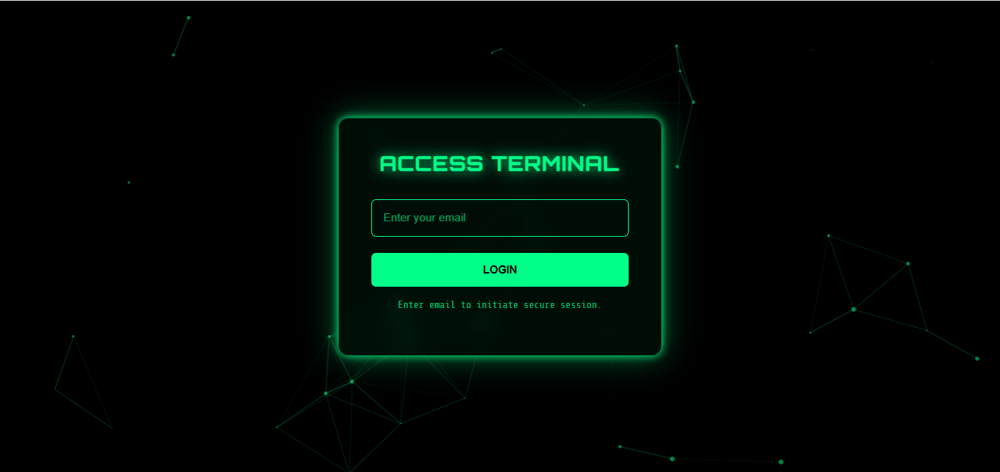
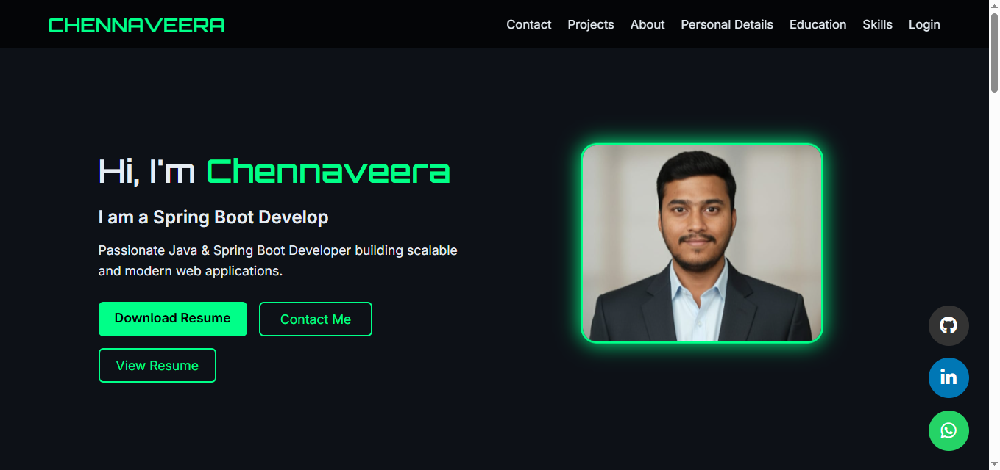
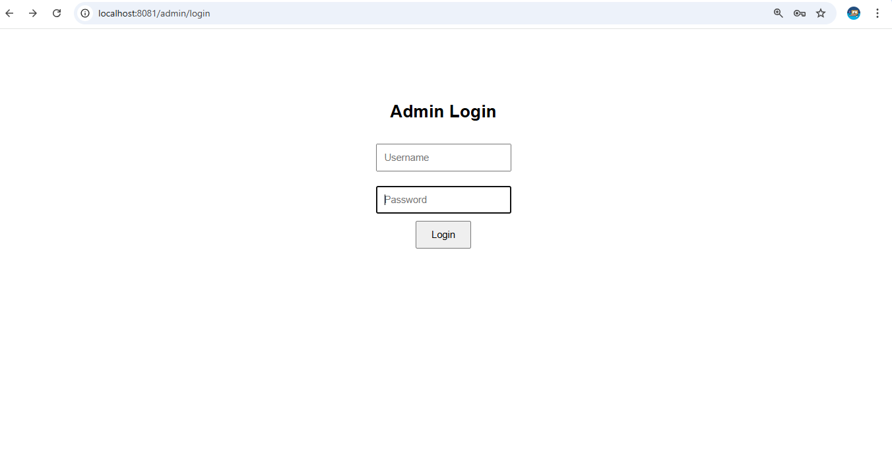
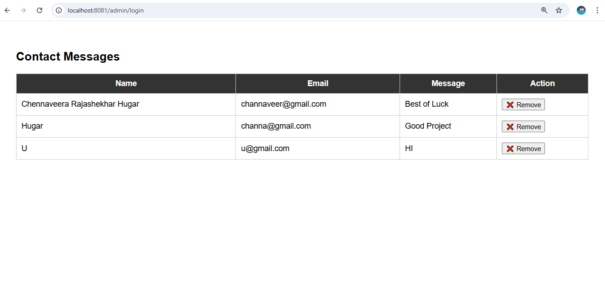

# 🚀 Spring Boot Portfolio Website

A professional portfolio web application built using Spring Boot, Thymeleaf, and MySQL.

---

## 📌 Features

- Responsive Home Page
- Secure Login System
- Contact Form
- MySQL Database Integration
- MVC Architecture
- Clean UI Design

---

## 🛠 Tech Stack

- Java 17
- Spring Boot
- Thymeleaf
- MySQL
- HTML, CSS, JavaScript
- Maven

---

## 📸 Screenshots

### 🔐 Login Page

  

### 🏠 Home Page

  

### 📬 Admin Login Page

  

### 📬 Contact Page

  

## ⚙️ Installation & Run (Using Eclipse)

1. Clone the repository:
   git clone https://github.com/Chennaveera/myportfolio.git

2. Open Eclipse IDE

3. Import the project:
   File → Import → Maven → Existing Maven Projects  
   Select the cloned `myportfolio` folder → Finish

4. Configure Database:
   - Ensure MySQL is running on port 3307
   - Update `application.properties` with your MySQL username & password

5. Run the Application:
   Right-click project → Run As → Spring Boot App

6. Open in browser:
   http://localhost:8081